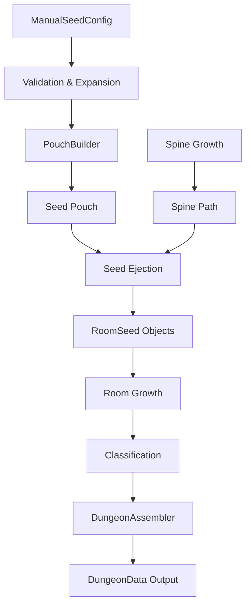

# Seed Lifecycle in the Seed-Growth Engine

This document traces the complete lifecycle of a seed within the `seed-growth` dungeon generation system, from initial configuration through final room extraction.

---

## Summary Table

| Stage | Phase | Key Component(s) | Trellis | Description |
|:---:|:---|:---|:---:|:---|
| 1 | **Configuration** | `SeedDefinitions.ts`, `ManualSeedSystem.ts` | N | Seed parameters are defined as `ManualSeedConfig` objects. |
| 2 | **Validation & Expansion** | `ManualSeedSystem.validateSeedBatch()`, `expandRepeats()` | N | Configs validated and `repeat` properties expanded. |
| 3 | **Pouch Construction** | `PouchBuilder.build()` | **Y** | Seed Pouch assembled; trellises trigger burst expansion and shape. |
| 4 | **Spine Growth** | `SpineSeedGenerator.stepSpine()` | N | Spine corridor path grown across the grid. |
| 5 | **Seed Ejection** | `SpineSeedGenerator.stepEjection()`, `ejectSeed()` | N | Seeds ejected from spine; mechanical execution only. |
| 6 | **Room Growth** | `SpineSeedGenerator.stepRoomGrowth()`, `growRoom()` | N | Each `RoomSeed` expands tile-by-tile (shape pre-set in Pouch). |
| 7 | **Classification** | `TrellisManager.processGlobalPhase('classification')` | **Y** | Room or cull check (e.g., `#cell` for minimum size). |
| 8a | **Room Extraction** | `SpineSeedClassifierFixed.classify()` | **Y** | Rooms extracted; internal finalization (e.g., `#alcove` walls). |
| 8b | **Heat Map Calculation** | `HeatMapCalculator.calculate()` | **Y** | Distance values assigned; hot/cold zone modifications. |
| 8c | **Corridor Assembly** | `CorridorPathfinder`, `TrellisManager` | **Y** | Corridors generated; rooms react to exits. |
| 8d | **Decoration** | `DungeonDecorator.decorate()` | **Y** | Doors, stairs, objects placed. |
| 8e | **Spine Pruning** | `SpinePruner.prune()` | N | Dead-end spine segments removed; final cleanup. |

---

## Stage 1: Configuration

**Location:** `SeedDefinitions.ts`, `ManualSeedSystem.ts`

A seed's life begins as a **`ManualSeedConfig`** object. This is a declarative blueprint that describes:

- **Identity**: `id`, `type`, `tags`
- **Geometry**: `shape` (rectangle/circle), `width`, `height` (as exact values or min/max ranges)
- **Placement**: `distance` from spine, `side` (left/right/both/random)
- **Control Flags**: `mandatory`, `allowMirror`, `repeat`
- **Trellis Tags**: `trellis[]` for special behaviors (e.g., `#spawn(4)`, `#cell`)
- **Metadata**: `metadata` object for custom scoring, loot tier, traps, etc.

> [!NOTE]
> Configs can be manually authored (in a JSON queue) or auto-generated as "virtual" seeds from global settings.

---

## Stage 2: Validation & Expansion

**Location:** `ManualSeedSystem.ts`

Before entering the Pouch, seed configs undergo:

1. **Validation** (`validateSeedBatch()`):
   - Schema version check (`schemaVersion: 1`)
   - Field normalization (defaults applied, garbage stripped)

2. **Repeat Expansion** (`expandRepeats()`):
   - If a config has `repeat: 3`, it becomes 3 separate entries
   - Each clone gets a unique ID suffix (`bossRoom` → `bossRoom_1`, `bossRoom_2`, etc.)
   - The `repeat` property is removed from the expanded clones

---

## Stage 3: Pouch Construction (The "Seed Pouch")

**Location:** `PouchBuilder.ts`

The **Seed Pouch** is a pre-built queue of all seeds to be ejected. The `PouchBuilder.build()` method:

1. **Iterates up to `seedCount`** (the target number of primary ejection events)
2. **Consumes from manual queue** first, then generates virtual configs
3. **Processes each candidate through the TrellisManager**:
   - If a seed has a trellis like `#spawn(4)`, the trellis executes during the `'ejection'` phase
   - Burst trellises return additional `ManualSeedConfig[]` entries that are appended to the Pouch
4. **Outputs the final Pouch array** for the generator to consume sequentially

```
[ ManualSeed1, BurstChild1, BurstChild2, VirtualSeed, ManualSeed2, ... ]
```

> [!IMPORTANT]
> **Burst/Cluster seeds do NOT count against the `seedCount` limit.** This allows dense local areas without affecting spine path length.

---

## Stage 4: Spine Growth

**Location:** `SpineSeedGenerator.ts` (Phase: `'spine'`)

Before seeds are ejected, the spine corridor must be established:

1. **Initial Spine Tile** is placed (typically at grid center-bottom)
2. **Active Heads** grow tile-by-tile using:
   - Waypoint following (for S/U/Fork shapes)
   - Weighted direction selection (straight bias, turn penalty)
3. **Spine tiles** are marked with `regionId = -1` and `isCorridor = true`
4. **Wide spines** (width 3, 5, 7) also mark neighbor columns

The spine phase completes when:
- All heads exhaust their waypoints/options
- The `tileBudget` is reached

---

## Stage 5: Seed Ejection

**Location:** `SpineSeedGenerator.ts` (Phase: `'ejection'`)

The generator walks along the spine tiles, ejecting seeds at calculated intervals:

1. **Distance Counter** (`distanceToNextEjection`) decrements per spine tile
2. **When zero**: `ejectSeed()` is called
3. **Popping from Pouch**: The next `ManualSeedConfig` is dequeued
4. **Side Resolution**: Left, right, both, or random based on config + symmetry settings
5. **Position Calculation**: `spineTile + direction × distance`
6. **RoomSeed Creation**: A `RoomSeed` object is instantiated with:
   - Position, dimensions, source config reference
   - `isDead` flag if landing on occupied tile or dud chance
   - `trellis`, `tags`, `content` from the config
7. **TrellisManager Hook**: `processPhase('ejection', context, roomSeed)` is called
8. **Initial Tile Marked**: If not dead, the seed's position tile becomes `'floor'`

> [!NOTE]
> **Paired Ejection**: If enabled, a secondary seed is also ejected farther along the same direction.
> **Symmetry**: Mirrored seeds share dimensions and are linked via `partnerId`.

---

## Stage 6: Room Growth

**Location:** `SpineSeedGenerator.ts` (Phase: `'roomGrowth'`)

Each active (non-dead, non-complete) `RoomSeed` grows toward its target dimensions:

1. **Active Seeds** are queried each step
2. **Growth Candidates**: North/South/East/West directions are evaluated
3. **Expansion Logic** (`expandRoom()`):
   - Validates all tiles in the expansion strip are empty
   - Collision detection against other regions
   - Updates `currentBounds` and `tiles[]`
   - Marks grid tiles with room's `regionId`
4. **Strict Symmetry**: Linked seeds (`partnerId`) grow in lockstep; both stop if one is blocked
5. **Completion**: Seed is marked `isComplete` when:
   - Target dimensions reached
   - No valid expansion directions remain

The phase ends when all seeds are complete or the tile budget is exhausted.

---

## Stage 7: Classification

**Location:** `TrellisManager.ts`, individual trellis implementations

After room growth completes, classification trellises execute:

```typescript
TrellisManager.getInstance().processGlobalPhase('classification', context)
```

This allows trellises attached to seeds (e.g., `#cell`, `#tinyTitan`) to:
- Subdivide rooms
- Tag rooms for special rendering
- Modify metadata

---

## Stage 8: Assembly & Output

**Location:** `DungeonAssembler.ts`

The final stage transforms raw grid state into usable `DungeonData` through five sub-stages:

### 8a. Room Extraction

**Component:** `SpineSeedClassifierFixed.classify()`

- Converts grown `RoomSeed` tiles into formal `Room[]` objects
- Calculates bounds, centroids, and area
- Transfers metadata from seed configs to rooms

### 8b. Heat Map Calculation

**Component:** `HeatMapCalculator.calculate()`

- Calculates distance scores for each room relative to spine/entrance
- Used for pathfinding priority and object placement

### 8c. Corridor Assembly (Trellis: `corridorAssembly`)

**Components:** `CorridorPathfinder`, `TrellisManager`

```typescript
TrellisManager.getInstance().processPhaseForRooms('corridorAssembly', context, rooms)
```

- Tributary corridors generated to connect rooms
- **Trellis hook** allows rooms to influence corridor behavior (e.g., alcoves)

### 8d. Decoration (Trellis: `decoration`)

**Component:** `DungeonDecorator.decorate()`

- Places doors, stairs, traps, and other objects
- **Trellis hook** allows rooms to inject custom objects

### 8e. Spine Pruning

**Component:** `SpinePruner.prune()`

- Removes dead-end spine segments not connected to rooms
- Final corridor consolidation
- Returns complete `DungeonData` with:
  - `rooms[]`, `spine[]`, `corridors[]`, `objects[]`
  - Grid dimensions and seed reference

---

## Visual Flow



---

## Key Data Structures

| Structure | Purpose |
|:---|:---|
| `ManualSeedConfig` | Declarative seed blueprint (pre-ejection) |
| `RoomSeed` | Active seed instance with position, tiles, state |
| `SpineTile` | Single tile in the spine path |
| `Room` | Final extracted room with bounds, centroid, metadata |
| `DungeonData` | Complete dungeon output (rooms, spine, objects) |

---

## Trellis Phases Summary

| Phase | When Executed | Typical Use |
|:---|:---|:---|
| `ejection` | During Pouch build OR at seed creation | Burst expansion (`#spawn`) |
| `roomGrowth` | During room expansion | Custom growth rules |
| `classification` | After growth completes | Room tagging, subdivision |
| `corridorAssembly` | During corridor generation | Custom corridor behavior |
| `decoration` | Before final output | Object placement |
| `spinePruning` | During spine cleanup | Endpoint handling |

